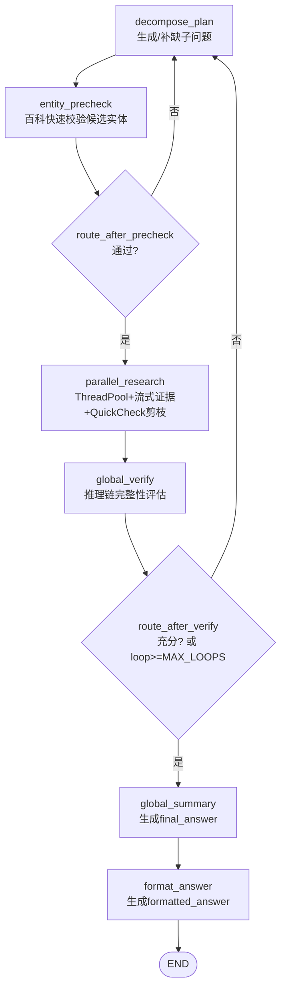
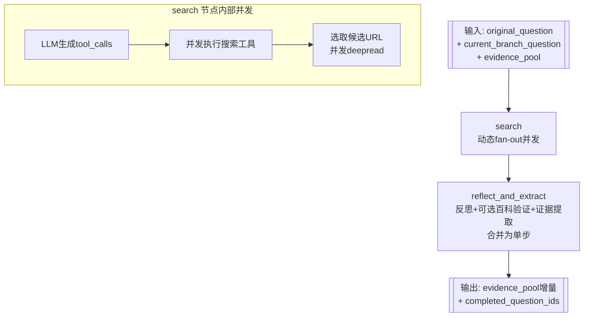

# 多智能体推理系统 — 设计与变更记录

## 架构概览（v6.0 实体预校验 + 反思证据合并架构）

```
┌──────────────────────────────────────────────────────────────────┐
│     主图（LangGraph + 实体预校验 + ThreadPool 流式证据 + 动态剪枝）  │
│                                                                  │
│  ┌──────────────┐                                                │
│  │ DecomposePlan│   奥卡姆剃刀：只为缺口生成子问题                     │
│  │  (ToT)       │                                                │
│  └──────┬───────┘                                                │
│         │                                                          │
│         ▼                                                          │
│  ┌──────────────┐                                                │
│  │EntityPrecheck│  百科快速校验候选实体（仅首轮，≤15s）              │
│  └──────┬───────┘                                                │
│         │ 通过                     不通过 ↩ DecomposePlan          │
│         ▼                          （附百科反馈）                   │
│  ┌─────────────────────────────────────────────────────┐    │
│  │          parallel_research 节点                         │    │
│  │  ThreadPoolExecutor + as_completed                   │    │
│  │  ┌─────────┐ ┌─────────┐ ┌─────────┐              │    │
│  │  │ Branch  │ │ Branch  │ │ Branch  │  并行执行    │    │
│  │  │  Q1     │ │  Q2     │ │  Q3     │  (子图)     │    │
│  │  └────┬────┘ └────┬────┘ └────┬────┘              │    │
│  │       ▼          ▼          │                    │    │
│  │  流式返回证据 → QuickCheck  │ ← 仍在运行        │    │
│  │  ✔ 充分 → 剪枝剩余分支 ───┘ ← 被剪枝(pruned)  │    │
│  └─────────────────────────────────────────────────────┘    │
│                        ▼                                           │
│               ┌──────────────┐                                   │
│    不充分      │ GlobalVerify │  推理链完整性判断                     │
│  ┌────────────│  (GoT)       │  (充分/不充分，非刚性%)              │
│  │            └──────┬───────┘                                   │
│  ▼                   │ 充分 or MAX_LOOPS                         │
│  DecomposePlan       ▼                                           │
│  (仅补缺口)    ┌──────────────┐   ┌────────────┐                │
│               │GlobalSummary │──▶│FormatAnswer │──▶END           │
│               │  (CoT)       │   └────────────┘                 │
│               └──────────────┘                                   │
└──────────────────────────────────────────────────────────────────┘
```

### 架构图（与当前代码一致，推荐）

#### 1) 主图（Supervisor Graph）



#### 2) 研究子图（Research Subgraph）



**v5.0→v6.0 核心变化**：
- 新增 **EntityPrecheck 节点**：在并行搜索前用百科快速校验候选实体，防止首步实体漂移
- **合并 reflect+evidence**：研究子图从 3 节点缩减为 2 节点，无 baike 时省 1 次 LLM 调用
- **修复子问题解析 bug**：`**子问题**：` markdown 格式泄漏到搜索查询中
- 保留 v5.0 所有能力：流式证据、动态剪枝、优先级调度

**6个图节点**：
- **DecomposePlan (ToT)**：奥卡姆剃刀拆分，证据驱动缺口分析
- **EntityPrecheck**：百科快速校验候选实体（仅首轮执行，≤15s）
- **ParallelResearch**：线程池并行 + 流式证据 + QuickCheck 动态剪枝
- **GlobalVerify (GoT)**：推理链完整性评估 + 剪枝建议
- **GlobalSummary (CoT)**：基于推理链推导最终答案
- **FormatAnswer (CoT)**：语义对齐 + 格式归一化

**工具**：`bocha_search` + `serper_search` + `baike_search`（自动验证），LangChain `@tool`

## 项目结构

```
dataAgent/
├── config/settings.py         # API密钥、模型、系统参数（含 QUICK_CHECK / MAX_PARALLEL / PRECHECK）
├── tools/search.py            # 搜索工具 @tool（博查 + Serper + 百科）
├── agents/prompts.py          # 9个提示词（含 ENTITY_PRECHECK / REFLECT_EVIDENCE 合并版）
├── graph/
│   ├── state.py               # Evidence + SubQuestion + AgentState（含 precheck 字段）
│   ├── nodes.py               # 5个节点函数 + entity_precheck + quick_sufficiency_check
│   ├── research_subgraph.py    # Research 子图（search → reflect_and_extract，2节点）
│   └── supervisor.py          # 图构建 + entity_precheck 路由 + 流式证据 + 动态剪枝
├── utils/answer_formatter.py  # LLM 答案归一化
├── main.py                    # 入口
└── requirements.txt
```

---

## 变更记录

### 2026-02-23 第二十四次修改（实体预校验 + 反思证据合并 + 子问题解析修复）

**需求**（来自 submit_run_2_23.log 分析）：
1. **首步实体漂移**：DecomposePlan 在第一步给出的候选实体可能与真实答案相差很远，导致后续所有搜索偏离方向。到 4 轮强制输出时答案仍错误（id=3,4,5,6 均耗时 585-662s）
2. **研究子图 LLM 调用冗余**：search→reflect→evidence 3 步串行，当不触发百科验证时 evidence 步可省略
3. **子问题解析 bug**：LLM 输出 `**子问题**：` 格式，markdown `**` 未被清除导致标签匹配失败，查询中携带 `子问题**：` 前缀

**根因分析**：
1. DecomposePlan 用 LLM 知识生成候选假设（设计意图），但无校验机制。一旦假设错误，后续搜索全部基于错误实体展开，浪费 3-4 轮循环（每轮 ~150s）
2. 研究子图 reflect 和 evidence 是独立的 LLM 调用，但 evidence 本质只是从 reflect 输出中提取一句话摘要 + 可靠性标签，无 baike 时可合并
3. 子问题解析时先用 `stripped` 变量匹配 `子问题：` 标签，但 LLM 输出的 `**子问题**：` 中 `**` 未预先清除，导致 `子问题：` 匹配失败，整行作为查询

| 时间 | 文件 | 位置 | 修改方法 | 说明 |
|------|------|------|----------|------|
| 15:35 | `config/settings.py` | 系统参数区 | 新增常量 | `MAX_PRECHECK_ENTITIES=3`（实体预校验最多验证候选数） |
| 15:35 | `graph/state.py` | `AgentState` | 新增 3 个字段 | `precheck_passed` / `precheck_count` / `precheck_feedback` |
| 15:35 | `agents/prompts.py` | 新增两个 prompt | 新增 | `ENTITY_PRECHECK_PROMPT`（百科校验判断）、`RESEARCH_REFLECT_EVIDENCE_PROMPT`（合并版反思+证据） |
| 15:35 | `graph/nodes.py` | 新增函数 | 新增 | `_extract_candidate_entities()`：从知识推理中提取 `**实体**` 格式的候选实体 |
| 15:35 | `graph/nodes.py` | 新增函数 | 新增 | `entity_precheck()`：并行百科查询 + 轻量 LLM 判断百科是否推翻假设，仅首轮执行 |
| 15:35 | `graph/nodes.py` | `decompose_plan()` | 修改 | 注入 `precheck_feedback` 到 prompt，使重规划时参考百科反馈 |
| 15:35 | `graph/nodes.py` | 子问题解析循环 | 修复 | 在标签匹配前先 `re.sub(r'\*{1,2}', '', stripped)` 清除 markdown |
| 15:35 | `graph/research_subgraph.py` | 整体重构 | 合并 | `_reflect` + `_extract_evidence` → `_reflect_and_extract`（无 baike 时 1 次 LLM，有 baike 时 2 次） |
| 15:35 | `graph/supervisor.py` | 图构建 | 新增节点+路由 | `entity_precheck` 节点 + `route_after_precheck` 条件路由 |
| 15:35 | `main.py` / `run_agent_submit.py` | 初始状态 | 新增字段 | `precheck_passed=True, precheck_count=0, precheck_feedback=""` |

<!--
#### 设计要点

**实体预校验（EntityPrecheck）**：
- 从 anchor_analysis 中用正则提取 `**粗体实体**`，过滤常见非实体粗体（置信度、推理依据等）
- 对 top-3 候选并行调用 baike_search（~3-5s），收集百科信息
- 用轻量 LLM 判断百科是否**明确推翻**假设（保守策略：信息不足=通过，仅矛盾=不通过）
- 不通过时将百科原文+反馈注入 decompose_plan 的 prompt，引导重新分析
- 仅首轮（loop_count=0 且 precheck_count=0）执行，后续轮次自动放行
- 预期收益：对失败案例（4轮强制输出）节省 1-3 轮无效搜索 = 150-450s

**反思+证据合并（reflect_and_extract）**：
- 合并 prompt 同时要求输出反思分析 + 证据总结
- 无 baike 触发时直接从合并输出解析证据（省 1 次 LLM 调用，~10s/分支）
- 有 baike 触发时仍用 RESEARCH_EVIDENCE_PROMPT 做第二次调用整合百科信息
- 研究子图从 3 节点（search→reflect→evidence）缩减为 2 节点（search→reflect_and_extract）
- 预期收益：每轮 3-4 分支 × 50% 无 baike × 10s = 15-20s/轮

**子问题解析修复**：
- 根因：LLM 输出 `1. **子问题**：query text` → strip 数字后得到 `**子问题**：query text` → 匹配 `子问题：` 失败
- 修复：在标签匹配前新增 `stripped_clean = re.sub(r'\*{1,2}', '', stripped).strip()` 清除所有 `*`
- 效果：`**子问题**：query text` → `子问题：query text` → 正确匹配并提取 `query text`
-->

### 2025-02-23 第二十三次修改（提示词层面消除 GlobalVerify 幻觉知识注入）

**需求**（来自 submit_run_2_23.log id=1 推理链分析）：
GlobalVerify 在构建推理链时，使用 LLM 自身训练数据知识（标注为"已知事实/外部知识/经查"）来填补证据池的缺口，导致：
- 本应判断"不充分→触发下一轮搜索"的场景，被 LLM 用幻觉知识强行补全为"充分"
- 幻觉知识一旦错误（如错误的期刊目录），整个推理链被污染，最终答案不可靠
- 具体案例：id=1 中 GlobalVerify 凭知识"脑补"了 JLAS 4:1 的目录，跳过了对期刊归属的搜索验证

**根因分析**：
1. `GLOBAL_VERIFY_PROMPT` 的推理链构建部分未明确约束"只能基于证据池推理"，LLM 自然倾向于用自身知识填补缺口
2. `GLOBAL_SUMMARY_PROMPT` 同样缺乏此约束
3. `QUICK_CHECK_PROMPT` 在动态剪枝时也可能引入外部知识导致误判充分性

**修改原则**：DecomposePlan 阶段允许用 LLM 知识生成假设（这是设计意图），但 GlobalVerify / GlobalSummary / QuickCheck 阶段必须严格基于证据池推理，不得引入外部知识

| 时间 | 文件 | 位置 | 修改方法 | 说明 |
|------|------|------|----------|------|
| 03:30 | `agents/prompts.py` | `GLOBAL_VERIFY_PROMPT` §2 推理链构建 | 新增铁律段落 | 禁止引入证据池外信息（"已知事实""外部知识""经查""根据常识"），要求每步引用证据编号，缺口必须标记而非补全 |
| 03:30 | `agents/prompts.py` | `GLOBAL_SUMMARY_PROMPT` 推理步骤末尾 | 新增铁律 | 同上约束：只能使用验证过的证据池信息推理 |
| 03:30 | `agents/prompts.py` | `QUICK_CHECK_PROMPT` 判断标准 | 新增注意事项 | 只能基于证据池判断充分性，不得引入自身知识补充推理 |

<!--
#### 设计思路
- DecomposePlan 是"假设生成器"，允许用 LLM 知识 → 生成候选假设 + 设计验证搜索
- GlobalVerify / GlobalSummary 是"证据裁判官"，只能基于搜索到的证据做判断
- 这种分工确保：知识用于引导搜索方向（高效），但不用于替代搜索结果（避免幻觉）
-->

### 2025-02-25 第二十二次修改（流式证据 + 动态剪枝架构 — 消除 Send API 等待全部完成瓶颈）

**需求**（来自 submit_run_2_23.log 耗时分析）：
Send API 架构存在“等待全部完成”瓶颈：当 4 个并行分支中 3 个在 60-80s 内完成但第 4 个需 180-200s 时，所有分支必须等待最慢的完成后才能进入 GlobalVerify。垄断时间浪费在等待而非推理。
具体表现：
- id=3：4 轮循环总耗时 1045s，每轮被最慢分支拖慢（最慢 Q6=182s）
- id=4：4 轮循环总耗时 996s，最慢分支 Q12=200s
- 多轮中大量分支产出 "low" 可靠性证据，且早期完成的分支证据可能已足以回答问题，但无法提前退出

**根因分析**：
1. **Send API 的等待全部完成语义**：LangGraph Send API 设计为“所有 Send 分支完成后才聚合”，无法在部分分支完成后提前评估充分性
2. **缺乏轮内剪枝机制**：即使前 2 个分支的证据已足以回答问题，剩余分支仍然继续执行并消耗时间/API配额
3. **无优先级调度**：所有子问题同等对待，低优先级探索性问题与高优先级验证性问题争抢同一时间窗口

**架构重设计**：用 `ThreadPoolExecutor + as_completed` 替代 Send API，实现流式证据 + 动态剪枝

| 时间 | 文件 | 位置 | 修改方法 | 说明 |
|------|------|------|----------|------|
| 00:00 | `config/settings.py` | L34-35 | 新增参数 | `QUICK_CHECK_MIN_EVIDENCE=2`（触发快速检查的最小证据数）、`MAX_PARALLEL_WORKERS=4`（线程池大小） |
| 00:00 | `agents/prompts.py` | L358-374 | 新增 prompt | `QUICK_CHECK_PROMPT`：轻量级充分性检查，仅输出“充分/不充分”+ 答案，供动态剪枝决策 |
| 00:00 | `graph/nodes.py` | 模块级 | 重构 | 移除死代码 `research_branch`（已被子图包装器替代）；新增 `quick_sufficiency_check()` 函数 |
| 00:00 | `graph/supervisor.py` | 全文件 | **架构重写** | 移除 Send API + `route_to_research`；新增 `_run_single_branch()`（线程安全子图包装器）+ `parallel_research()`（核心节点：ThreadPoolExecutor + as_completed + QuickCheck + 剪枝）；图结构简化为 `decompose_plan → parallel_research → global_verify → ...` |
| 00:00 | `Agent.md` | 架构图 + 变更记录 | 更新 | 更新架构图为 v5.0，新增变更记录 |

<!--
#### 核心设计详解

##### 1. 从 Send API 到 ThreadPool 的架构转变
旧架构（Send API）：
```
decompose_plan → Send("research_branch", state_1) + Send("research_branch", state_2) + ...
                  ↓↓↓ 并行执行，但必须全部完成后才聚合 ↓↓↓
                → global_verify
```

新架构（ThreadPool + 流式证据）：
```
decompose_plan → parallel_research(内部线程池)
                  │
                  ├─ Branch Q1 完成 → 证据流入 → QuickCheck → 不充分，继续
                  ├─ Branch Q2 完成 → 证据流入 → QuickCheck → 充分！剪枝 Q3/Q4
                  └─ (不等待 Q3/Q4)
                → global_verify
```

核心优势：
- 消除“等待全部完成”瓶颈：不再被最慢分支拖慢
- 流式证据即时评估：每个分支完成后立即检查充分性
- 动态剪枝省时省资源：充分后立即停止剩余分支
- 优先级调度：高优先级子问题优先提交执行

##### 2. QuickCheck 的设计权衡
- 每次 QuickCheck 是一次 LLM 调用（~5-10s），在 4 个分支的场景下最多触发 3 次
- 潜在开销：15-30s；潜在收益：避免 1 轮完整循环（200-400s）
- 触发条件：证据数 >= QUICK_CHECK_MIN_EVIDENCE 且仍有未完成分支
- 偏保设计：即使 QuickCheck 误判充分，后续 GlobalVerify 会做完整检查

##### 3. 线程安全考虑
- evidence_snapshot 是只读副本，各线程不修改
- new_evidence 和 new_completed_ids 仅在主线程（as_completed 循环）中修改
- stop_event 是 threading.Event，线程安全
- executor.shutdown(wait=False, cancel_futures=True) 确保未启动的任务被取消

##### 4. 与子图的关系
- research_subgraph 保持不变，仍为 search→reflect→evidence 固定流程
- 每个线程通过 _run_single_branch() 调用 subgraph.invoke()
- 子图内部也用 ThreadPoolExecutor 做多引擎并发，嵌套线程在 Python 中安全
-->

---

### 2025-02-24 第二十一次修改（重复派发修复 + 子图可观测性 + 控制台排版优化）

**需求**（来自 submit_run_2_23.log 第3-4轮分析）：
日志显示第3轮 Router 分派了 14 个并行研究分支（Q1-Q14），其中 Q1-Q11 早在前2轮已完成，被**重复派发**。根本原因：`completed_question_ids` 字段未定义在 `ResearchSubgraphState` 中，LangGraph 子图静默丢弃该字段 → 主图包装器 `out.get("completed_question_ids")` 始终返回 `[]` → 子问题永远不被标记完成。
同时用户要求：在控制台可看到每次子图的内部结构（search→reflect→evidence 各阶段），并优化控制台打印排版。

**根因分析**：
1. **`ResearchSubgraphState` 缺少 `completed_question_ids` 字段**：`_extract_evidence` 返回 `{"completed_question_ids": [q_id]}`，但该字段不在子图 state schema 中 → LangGraph 静默丢弃 → `supervisor.py` 包装器 `out.get(...)` 得到 `[]` → `operator.add` 累积的 `completed_question_ids` 始终为空列表 → `decompose_plan` 和 `route_to_research` 中的状态更新逻辑形同虚设 → **每轮重复派发所有子问题**
2. **无子图内部可观测性**：`research_subgraph.py` 的三个节点（search/reflect/evidence）无任何 print 输出 → 控制台仅能看到"处理 Q1"和"Q1 子图完成"，中间过程完全黑盒
3. **`decompose_plan` 打印不区分已完成/待处理**：所有子问题按统一格式打印，难以快速判断实际新增了几个问题

| 时间 | 文件 | 位置 | 修改方法 | 说明 |
|------|------|------|----------|------|
| 00:00 | `graph/research_subgraph.py` | `ResearchSubgraphState` | 新增字段 | 新增 `completed_question_ids: list`，确保子图 state schema 包含此字段，LangGraph 不再静默丢弃 |
| 00:00 | `graph/supervisor.py` | `research_branch` 返回值 | BUG-FIX | 改为直接 `[q_id] if q_id != "?" else []`，不再依赖 `out.get("completed_question_ids")`（双重保险） |
| 00:00 | `graph/supervisor.py` | `route_to_research` | 增强 | 新增 `completed_question_ids` 双重过滤：`sq["status"] == "pending" and sq["id"] not in completed_set`；打印增加总计/已完成统计 |
| 00:00 | `graph/research_subgraph.py` | `_search_parallel` | 新增日志 | 添加 `[Q{id}/Search]` 前缀日志：LLM工具选择、搜索结果数、DeepRead 补充数 |
| 00:00 | `graph/research_subgraph.py` | `_reflect` | 新增日志 | 添加 `[Q{id}/Reflect]`、`[Q{id}/BaikeVerify]` 日志：反思状态、百科验证实体及数量 |
| 00:00 | `graph/research_subgraph.py` | `_extract_evidence` | 新增日志 | 添加 `[Q{id}/Evidence]` 日志：证据ID、可靠性、陈述摘要（≤80字） |
| 00:00 | `graph/nodes.py` | `decompose_plan` 打印 | 重构 | 分组显示 done/pending/pruned，统计各状态数量；已完成问题截断60字，待处理问题完整显示 |
| 00:00 | `graph/nodes.py` | `global_verify` 打印 | 增强 | 新增子问题完成率和证据池数量统计行 |

<!--
#### 核心知识点

##### 1. LangGraph 子图 State Schema 的静默丢弃行为
LangGraph 的 `StateGraph` 使用 `TypedDict` 定义 state schema。当节点返回的 dict 中包含 schema 未定义的 key 时，该 key 被**静默丢弃**（不报错、不警告）。这是 LangGraph 的设计行为而非 bug，但对开发者来说是一个危险的陷阱。

本次 bug 的表现链：
```
_extract_evidence 返回 {"completed_question_ids": [q_id]}
→ ResearchSubgraphState 无此字段
→ LangGraph 静默丢弃
→ subgraph.invoke() 输出无此 key
→ supervisor 包装器 out.get("completed_question_ids", []) = []
→ 主图 operator.add 累积空列表
→ completed_question_ids 始终为 []
→ decompose_plan 的状态更新 loop 永远不触发
→ route_to_research 每轮重复派发所有子问题
```

**教训**：子图返回值的每个 key 都必须在子图 state schema 中声明。如果需要透传数据给主图，有两种方式：
- 方式A：在子图 state schema 中声明字段（本次采用）
- 方式B：在主图包装器中直接计算，不依赖子图输出（本次也做了，双重保险）

##### 2. 并行分支的日志可读性
Send API 并行执行的分支会交替输出日志。解决方案：所有子图内部日志使用 `[Q{id}/阶段]` 前缀，便于在混合输出中按 Q_id 过滤跟踪单个分支的完整流程。

##### 3. 修复后的预期行为变化
- 修复前：每轮派发所有子问题（Round1: 4个, Round2: 8个, Round3: 14个）→ API调用指数增长
- 修复后：每轮仅派发新增子问题（Round1: 4个, Round2: ≤4个新增, Round3: ≤4个新增）→ API调用线性增长
- 预期耗时降低 60-70%（消除重复搜索的时间和 API 消耗）
-->

---

### 架构改进建议（待评估）

| # | 方向 | 现状 | 建议 | 优先级 |
|---|------|------|------|--------|
| 1 | 并发分支上限 | 无上限（受 LLM 输出控制） | 在 `route_to_research` 中增加 `MAX_CONCURRENT_BRANCHES` 上限（建议 6），超出部分排队到下一轮 | 中 |
| 2 | 证据池 token 预算 | 无限增长 | 为 `_evidence_summary` 增加 token 估算，超出阈值时按可靠性排序截断低价值证据 | 中 |
| 3 | 证据 ID 碰撞 | `id = q_id * 10`，跨轮同 q_id 会覆盖 | 改用 `q_id * 100 + loop_count * 10` 或全局自增 ID | 低 |
| 4 | 子图错误隔离 | 子图节点异常导致整个分支静默失败 | 在 supervisor 包装器中 try/catch，失败分支返回空证据 + 错误日志 | 中 |
| 5 | 搜索结果去重 | 不同分支可能搜到相同 URL | 在 `global_verify` 中对 evidence_pool 按 source_urls 去重合并 | 低 |

---

### 2026-02-23 第二十次修改（Research 子图封装 + 动态并发 — 缩短单子问题耗时）

**需求**（来自 run_log.txt 耗时过长分析）：
当前 Send API 仅实现"子问题级并发"，但每个 ResearchBranch 内部仍是固定串行流程（search→deepread→reflect→baike→evidence），且 search 阶段对多个搜索引擎的调用是顺序执行，导致整体耗时过长。

**设计原则**：把固定研究流程封装为可复用子图（Research Subgraph），主图 Send 并发分发子图实例；在子图内部对多引擎搜索与 DeepRead 做动态并发（按需 fan-out），减少单分支 wall time。

| 时间 | 文件 | 位置 | 修改方法 | 说明 |
|------|------|------|----------|------|
| 00:05 | `graph/research_subgraph.py` | 全文件 | 重写（从占位模块变为可执行子图） | 新增 `compile_research_subgraph()`；子图节点：`search`（bocha/serper/baike 并发 + deepread 并发）→ `reflect`（LLM 反思 + 可选百科验证）→ `evidence`（LLM 证据提取） |
| 00:07 | `graph/research_subgraph.py` | `search` 节点 | 增强 | `search` 阶段复用 `RESEARCH_SEARCH_PROMPT` + LLM tool-calling 生成查询，再将 tool_calls 并发执行（fallback 保留 engine 直连） |
| 00:05 | `graph/supervisor.py` | research_branch 节点 | 重构 | 主图 `research_branch` 改为子图包装器：调用 `_RESEARCH_SUBGRAPH.invoke(...)` 并仅回传 `evidence_pool` + `completed_question_ids`，避免把大字段合并回主状态 |
| 00:08 | `graph/supervisor.py` | research_branch 节点 | 增强 | 增加每个 Q 的子图耗时日志，便于在 run_log 中定位瓶颈 |
| 00:35 | `Test/run_agent_submit.py` | `run_one_question` | 增强 | 批量脚本输出兼容：当 `formatted_answer` 为空时 fallback 到 `final_answer`，避免批量生成出现空答案 |

<!--
#### 知识点（便于 review）
- Send API 并发粒度：当前主图并发的是 "pending 子问题"，即 Q 级并发；若单个 Q 内部 search/reflect/evidence 仍串行，则单 Q 的 wall time 仍然成为瓶颈
- 动态并发（fan-out）：在子图内部根据 `search_engine` 决定并发调用数量（both=2个引擎，否则=1个）；DeepRead 对候选 URL 并发抓取
- 性能与安全：网络 IO 为主的搜索/抓取非常适合线程并发；但子图输出应尽量小（只回传证据与完成标记），否则主状态合并成本会上升且 run_log 过长
 - 批量生成兼容：`Test/run_agent_submit.py` 通过 `graph.supervisor.compile_graph().invoke()` 调用当前系统；输出字段优先 `formatted_answer`，为空则使用 `final_answer`
-->

### 2025-02-22 第十九次修改（假设驱动架构 — 从"搜索发现"转为"知识推理+验证搜索"）

**需求**（来自 run_log.txt 同一推理过程的深层分析）：
第十八次修改解决了搜索查询和答案格式问题，但同一 run_log 暴露了更根本的架构缺陷：系统完全不利用 LLM 自身知识，把所有推理外包给搜索引擎。
具体表现：
1. DecomposePlan 把原题条件拆分后加"查找"变成子问题（如"查找16世纪既是军事领袖又以笔名创作诗歌的统治者"），这是复述不是分解
2. Q3/Q4/Q8 三个抽象描述性子问题全部返回"未获得有效信息"，浪费37.5%的搜索资源
3. Q5 的 Google 结果明确包含"pen name Muhibbi"（6条结果），但证据提取输出"未获得有效信息"
4. 整个推理耗时694秒、2轮8个子问题，而 LLM 自身知识足以在第一步就推断出候选实体

**根因分析（2 项，均为架构级问题）**：
1. **DECOMPOSE_PLAN_PROMPT 把 LLM 当"问题拆分器"而非"知识推理器"**：prompt 从未要求 LLM 先用自身知识推理候选实体，直接跳到"设计搜索"。导致子问题是原题的描述性复述，搜索引擎无法处理
2. **RESEARCH_REFLECT/EVIDENCE_PROMPT 的信息丢失链**：多引擎结果（博查24条+Google9条）被截断为12000字符→大量无关博查结果占据字符预算→Google的关键结果被淹没→反思遗漏→证据提取默认输出"未获得有效信息"

**设计原则**：从"搜索驱动"（search-to-discover）转为"假设驱动"（hypothesize-then-verify）。LLM 先用自身知识形成候选假设，搜索只做验证和补充

| 时间 | 文件 | 位置 | 修改方法 | 说明 |
|------|------|------|----------|------|
| 23:17 | `agents/prompts.py` | `DECOMPOSE_PLAN_PROMPT` | 重写 | 新增"第一步：知识推理"（特征提取与候选推断→推理链构建→知识缺口识别）；"第二步"从"生成子问题"改为"设计验证性搜索"（验证类/探索类/补缺类）；新增禁止事项"禁止复述原题""禁止用描述性长句代替已知实体名" |
| 23:17 | `agents/prompts.py` | `RESEARCH_REFLECT_PROMPT` 步骤1 | 修改 | "逐条扫描"改为"分来源扫描"：强调每个搜索引擎的结果必须分别检查，即使某引擎大多无关也不能跳过其他引擎的结果 |
| 23:17 | `agents/prompts.py` | `RESEARCH_REFLECT_PROMPT` 步骤2 | 修改 | 新增强调"即使只有1条结果包含关键信息也必须提取" |
| 23:17 | `agents/prompts.py` | `RESEARCH_EVIDENCE_PROMPT` 要求4 | 修改 | "未获得有效信息"从默认 fallback 改为"最后手段"：只有当反思结果中确实没有任何相关实体/事实时才可使用 |
| 23:17 | `graph/nodes.py` | `decompose_plan` 解析 | 修改 | 兼容新输出格式"## 知识推理"（同时保留旧版"## 锚点分析"的兼容）；新增"验证目标"字段解析；日志标签改为"知识推理" |

<!--
#### 核心设计详解

##### 1. 架构转变：搜索驱动 → 假设驱动
旧架构（搜索驱动）：问题→拆分子问题→搜索→反思→推理
- LLM 仅负责拆分和反思，不使用自身知识
- 子问题 = 原题条件的描述性复述
- 搜索引擎承担全部发现任务（但搜索引擎不做语义推理）

新架构（假设驱动）：问题→LLM 知识推理→形成候选假设→设计验证搜索→确认/否定
- LLM 先用自身知识推断候选实体（如"16世纪+笔名诗人+法典编纂"→苏莱曼一世）
- 子问题 = "验证[具体实体名]+[待验证属性]"（如"验证苏莱曼一世以笔名Muhibbi创作诗歌"）
- 搜索引擎只做验证和补充，不做从零发现

预期效果（以同一题目为例）：
- 旧：Q1="查找16世纪既是军事领袖又以笔名创作诗歌的统治者" → 博查返回拿破仑、曹操
- 新：Q1="验证苏莱曼一世是否以笔名Muhibbi创作诗歌" → 搜索"苏莱曼一世 Muhibbi 笔名 诗歌" → 直接命中

##### 2. 证据丢失修复
问题链：博查24条无关结果（占大量字符）→ 12000字符截断 → Google关键结果被淹没
修复策略：
- 根本解决：假设驱动的子问题更精准 → 搜索结果更相关 → 无关噪声减少
- 防御性修复：反思 prompt 要求分来源扫描 + 证据 prompt 收紧"未获得有效信息"逃逸条件
-->

---

### 2025-02-22 第十八次修改（搜索查询构造 CoT + 答案语义对齐 CoT — 用推理步骤替代规则列表）

**需求**（来自 run_log.txt 推理过程分析）：
Agent 处理一个历史推理题（16世纪两位君主 → 共同宣称继承的古老文明），暴露两个问题：
1. 博查搜索查询为完整自然语言句子（如"查找16世纪既是军事领袖又以笔名创作诗歌还主持过法典编纂工作的帝国统治者"），搜索引擎做关键词匹配而非语义理解，导致返回大量不相关结果（拿破仑、曹操等）
2. 问题明确问"这个古老的**文明**是什么？"，但 FormatAnswer 输出"拜占庭帝国"（帝国≠文明），答案实体类型与问题期望不一致

**根因分析（2 项，均为 prompt 架构问题）**：
1. **`RESEARCH_SEARCH_PROMPT` 缺少查询构造推理**：prompt 本质是"工具路由器"（选哪个搜索引擎），没有引导 LLM 做"意图分解→关键词提取→查询组装"的推理过程。LLM 直接将自然语言子问题原文传给搜索工具，搜索引擎无法理解语义
2. **`FORMAT_ANSWER_PROMPT` 缺少语义对齐推理**：prompt 本质是"文本清洗器"（去括号、去 Markdown），没有引导 LLM 做"分析问题期望什么→检查答案是否匹配"的推理过程。LLM 只做表面格式变换，不做问题-答案的语义层面对齐

**设计原则**：两个 prompt 均从"规则列表"重构为"CoT 推理步骤"，用通用推理方法论替代特定场景的枚举式补丁

| 时间 | 文件 | 位置 | 修改方法 | 说明 |
|------|------|------|----------|------|
| 22:50 | `agents/prompts.py` | `RESEARCH_SEARCH_PROMPT` | 重写为 CoT | 角色从"工具路由器"重构为"查询翻译器"；新增4步推理：意图分解→关键词提取→查询组装→工具匹配；核心原则：搜索引擎是倒排索引关键词匹配系统 |
| 22:50 | `agents/prompts.py` | `FORMAT_ANSWER_PROMPT` | 重写为 CoT | 角色从"文本清洗器"重构为"语义对齐专家"；新增4步推理：问题意图分析→核心提取→语义对齐→格式归一化；关键步骤3"语义对齐"用通用原则（类型/语言/粒度对齐）替代枚举式类型列表 |
| 22:50 | `tools/search.py` | `bocha_search` docstring | 修改 | "支持自然语言句子"→"输入精准中文关键词组合"；示例从完整句子改为关键词 |
| 22:50 | `graph/nodes.py` | `format_answer` 节点 | 新增安全解析 | 新增 `_extract_final_answer()` 函数：CoT prompt 可能导致 LLM 泄漏推理过程，从多行输出中提取最终答案行 |

<!--
#### 核心设计详解

##### 1. Prompt 架构问题：规则列表 vs CoT 推理步骤
旧架构（规则列表）：给 LLM 一组 if-then 规则，LLM 机械执行
- 问题：无法泛化到未列举的场景（如枚举了"文明/帝国/朝代"，遇到"战役/河流/理论"就失效）
- 根因：规则是特定场景的补丁，不是通用方法论

新架构（CoT 推理步骤）：引导 LLM 按步骤推理，每步基于通用原则
- 优点：LLM 先分析场景（问题类型/搜索意图），再基于通用原则决策，自然泛化到所有场景
- 关键：步骤中只描述"做什么判断"（分析问题期望的答案类型），不描述"具体答案是什么"（不列举文明/帝国/朝代）

##### 2. RESEARCH_SEARCH_PROMPT：查询翻译器模型
LLM 的角色是在两种能力之间架桥：
- 语义理解（LLM 擅长）：理解"16世纪同时是军事领袖、诗人、法典编纂者的帝国统治者"指的是苏莱曼一世
- 关键词匹配（搜索引擎擅长）：根据精准关键词"苏莱曼一世 笔名 诗人 法典"匹配到目标网页

4步推理流程：
1. 意图分解：寻找什么类型的信息？什么网页会包含答案？
2. 关键词提取：核心实体 + 区分性属性，丢弃虚词和描述性从句
3. 查询组装：2-5个关键词短查询，候选实体名+属性词
4. 工具匹配：按语言和内容类型选择搜索工具

##### 3. FORMAT_ANSWER_PROMPT：语义对齐模型
格式化不是文本清洗，而是问题-答案语义对齐：
1. 问题意图分析：期望什么类型/语言/粒度的答案？
2. 核心提取：剥离推理过程和修饰文字
3. 语义对齐（关键）：答案的实体类别是否匹配问题的语义期望？不匹配则转换
4. 格式归一化：去除符号、统一格式

"语义对齐"是通用原则——不管问题问的是"文明""战役""河流"还是"理论"，LLM 都能通过分析问题疑问焦点自动判断答案类型是否匹配，无需枚举。

##### 4. 安全解析器 _extract_final_answer()
CoT prompt 的副作用：LLM 可能输出推理步骤而非纯答案。
解决方案：从多行输出中反向扫描，跳过以"步骤/###/分析"等开头的推理行，返回最后一个实质内容行。
-->

---

### 2025-02-22 第十七次修改（条件核查清单 + 假设审计边界约束 + 反确认偏差 — 修复假设审计滥用导致的错误答案）

**需求**（来自 id=29 推理失败分析）：
Agent 处理一个英文问题（男歌手因与全球知名女歌手合作二重唱而成名，该女歌手官网正在推广纪录片，求纪录片中心人物的法语名字）。正确答案几乎肯定是 Céline Dion（法裔加拿大歌手，2024年纪录片"I Am: Celine Dion"），但系统在第2轮输出了"BLACKPINK"（韩国女子团体）。

**根因分析（4 项）**：
1. **假设审计被滥用为翻转硬性约束的工具**：第15次修改引入的假设审计机制本意是解决解读歧义（如"西海岸"的含义），但 GlobalVerify 将其用于翻转问题的明确陈述——把"female vocalist"(单数个人)翻转为"可以是女子团体"，把"a male singer became widely known after collaborating"翻转为"也许是文学性表述"。这完全违背了假设审计的设计初衷
2. **GlobalVerify 过早判断"充分"**：BLACKPINK 完全不满足"male singer"条件，且"官网推广纪录片"条件未被验证，但 Verify 仍判定充分。原因是判断标准中缺乏对问题明确条件的逐一核查机制
3. **DecomposePlan 确认偏差**：第1轮 Q3 返回 BLACKPINK 的 YouTube 订阅数据后，第2轮 DecomposePlan 将全部子问题集中在 BLACKPINK 上（Q5 专门查 BLACKPINK 官网），完全忽略了初始分析中已提到的 Céline Dion 等替代候选
4. **交叉验证仅在 GlobalSummary 中**：第16次修改添加的交叉验证规则只在 GLOBAL_SUMMARY_PROMPT 中，但错误发生在更早的 GLOBAL_VERIFY_PROMPT 阶段（判断"充分"后直接进入 Summary，来不及纠错）

| 时间 | 文件 | 位置 | 修改方法 | 说明 |
|------|------|------|----------|------|
| 21:21 | `agents/prompts.py` | `GLOBAL_VERIFY_PROMPT` 步骤2.1 | 新增 | 新增「条件核查清单」：从原始问题提取所有明确条件，对候选答案逐一标记 ✓/✗/?，任何 ✗ 则排除该候选 |
| 21:21 | `agents/prompts.py` | `GLOBAL_VERIFY_PROMPT` 步骤2.5 | 重写 | 假设审计增加边界约束：严格区分「可翻转的解读性假设」vs「不可翻转的问题明确陈述」；绝对禁止翻转性别/单复数/代词/因果关系/实体类型等硬性约束 |
| 21:21 | `agents/prompts.py` | `GLOBAL_VERIFY_PROMPT` 步骤3 | 修改 | "充分"标准增加：候选答案必须与所有明确条件不冲突；条件核查清单有任何 ✗ 则必须判为不充分 |
| 21:21 | `agents/prompts.py` | `GLOBAL_VERIFY_PROMPT` 输出格式 | 修改 | 新增 `## 条件核查清单` 输出区块；`## 假设审计` 改为仅列出可翻转假设 |
| 21:21 | `agents/prompts.py` | `DECOMPOSE_PLAN_PROMPT` 核心原则 | 新增规则7 | 多候选探索：当已有证据指向某候选但未完全验证时，至少保留1个子问题探索替代候选 |
| 21:21 | `agents/prompts.py` | `DECOMPOSE_PLAN_PROMPT` 禁止事项 | 新增规则7 | 禁止将所有新子问题围绕单一未验证候选生成 |

<!--
#### 核心设计详解

##### 1. 条件核查清单（GLOBAL_VERIFY_PROMPT 步骤2.1）
在推理链构建后、假设审计前，强制 LLM 从原始问题提取所有明确条件并逐一核查。
id=29 案例中，BLACKPINK 的核查清单应为：
- ✗ "a male singer became widely known after collaborating on a duet with..." → BLACKPINK 无对应男歌手
- ✓ "globally recognized female vocalist" → BLACKPINK 全球知名（但 vocalist 是单数个人，团体应标 ✗）
- ✓ "official online platform linked from video-sharing channel" → blackpinkofficial.com 链接自 YouTube
- ? "website promoting documentary about life and career" → 未验证
由于存在 ✗，BLACKPINK 必须被排除，系统会继续搜索其他候选。

##### 2. 假设审计边界约束（步骤2.5 重写）
旧行为：假设审计可以翻转任何"隐含假设"，包括问题的明确陈述
新行为：严格划分两类：
- 可翻转（解读性假设）：术语理解方式，如"首个分部"可指总部或卫星办公室
- 不可翻转（问题明确陈述）：性别、数量、代词、因果关系、实体类型等
绝对禁止翻转不可翻转事实，堵住了 LLM 将 "female vocalist" → "female group" 的漏洞。

##### 3. 反确认偏差（DECOMPOSE_PLAN_PROMPT 规则7）
旧行为：Round 2 的 DecomposePlan 说"E30已指向BLACKPINK，这是一个强信号"→ 所有子问题围绕 BLACKPINK
新行为：规则7 要求至少保留1个子问题探索替代候选 → 如果有1个子问题搜索"Céline Dion documentary official website French"，很可能直接找到正确答案

##### 4. 假设审计的正确用途 vs 滥用
正确用途（id=82 案例）：微软研究院"西海岸的首个分部"→ 翻转"分部≠总部"的解读 → 发现总部 Redmond 就在西海岸 → 矛盾消除
滥用（id=29 案例）：问题明确说"female vocalist"(单数个人) → 翻转为"可以是女子团体" → 这不是解读歧义，而是违背问题的明确语义
区分标准：术语的含义范围可以翻转（"分部"的外延），但语法上的硬性约束不可翻转（单数 vs 复数，个人 vs 团体）
-->

---

### 2025-02-22 第十六次修改（并行独立性 + 查询去重 + 多跳交叉验证 — 修复强制通过时的幻觉答案）

**需求**（来自 id=86 推理失败分析）：
Agent 处理一个三跳关联问题（小微企业调研组成员 ↔ 体育锻炼论文作者 ↔ 80年代空难机组成员同名），耗时 508s 跑满 4 轮 MAX_LOOPS，产出 13 条证据全部标记 low/medium 且明确表示"未获得有效信息"。GlobalVerify 明确输出"无法给出确定答案"，但被强制通过后 GlobalSummary 凭空编造了"林春霞"（仅满足 3 个条件中的 1 个）。

**根因分析（4 项）**：
1. **依赖型子问题被并行执行**：Q2"根据上一问题确定的空难事故，查找机组成员名单"依赖 Q1 结果，但被 Send API 同时派发，Q2 无上下文执行，浪费搜索配额
2. **搜索查询跨轮次语义重复**：4 轮中对空难的搜索关键词几乎相同（仅"20世纪80年代"↔"1980年至1989年"的措辞变化），DecomposePlan 未获得已失败查询的具体内容和结果
3. **强制通过后 GlobalSummary 幻觉**：MAX_LOOPS 触发强制 `is_sufficient=True`，但 GLOBAL_SUMMARY_PROMPT 指令"不要回答'无法确定'"，LLM 从单一证据中随机选了"林春霞"
4. **多跳问题缺乏交叉验证**：GlobalSummary 未要求答案同时满足问题中所有条件，仅匹配单一条件的实体被当作最终答案

| 时间 | 文件 | 位置 | 修改方法 | 说明 |
|------|------|------|----------|------|
| 11:42 | `graph/state.py` | `AgentState` | 新增字段 | 新增 `force_passed: bool`，标记是否因 MAX_LOOPS 强制通过 |
| 11:42 | `config/settings.py` | L33 | 参数调整 | `MAX_BAIKE_VERIFY`: 1→2，允许每个研究分支更多百科验证 |
| 11:42 | `agents/prompts.py` | `DECOMPOSE_PLAN_PROMPT` 核心原则 | 新增规则5、6 | 规则5：并行独立——所有子问题并行执行，禁止引用其他子问题结果；规则6：查询多样性——失败后必须换用完全不同的策略 |
| 11:42 | `agents/prompts.py` | `DECOMPOSE_PLAN_PROMPT` 上下文 | 新增参数 | 新增 `{failed_queries}` 占位符，向 LLM 展示已尝试的搜索方向及结果摘要 |
| 11:42 | `agents/prompts.py` | `DECOMPOSE_PLAN_PROMPT` 禁止事项 | 修改规则3、新增5-6 | 规则3 强化：禁止语义重复（微调措辞≠新查询）；规则5：禁止依赖型子问题；规则6：连续失败应反思术语理解 |
| 11:42 | `agents/prompts.py` | `GLOBAL_SUMMARY_PROMPT` 推理步骤 | 新增步骤5、修改步骤6 | 步骤5：多条件交叉验证——多跳问题答案必须同时满足所有条件；步骤6：替换"不要回答无法确定"为更精细的指导 |
| 11:42 | `graph/nodes.py` | 新增函数 | 新增 | `_failed_queries_summary()`：从已完成子问题+证据池构建搜索历史摘要 |
| 11:42 | `graph/nodes.py` | `decompose_plan` | 修改 | 调用 `_failed_queries_summary()` 并传入 prompt |
| 11:42 | `graph/nodes.py` | `global_verify` | 修改 | 强制通过时设置 `force_passed=True` 并写入状态 |
| 11:42 | `main.py` | `initial_state` | 新增 | 初始化 `force_passed: False` |
| 11:42 | `Test/run_agent_submit.py` | `initial_state` | 重写 | 更新为 Send API 架构的正确字段（移除废弃的 `current_question_id` 等旧字段） |

<!-- 
#### 核心设计详解

##### 1. 并行独立性约束（DECOMPOSE_PLAN_PROMPT 规则5）
Send API 将所有 pending 子问题同时派发执行，每个分支独立运行、互不通信。
旧行为：LLM 生成 Q2"根据上一问题确定的空难事故，查找机组成员名单"→ Q2 执行时 Q1 尚未完成 → Q2 搜索无上下文 → 浪费配额
新行为：prompt 明确"所有子问题将被同时并行执行，每个必须完全自包含"→ LLM 不再生成依赖型子问题

##### 2. 搜索历史去重（_failed_queries_summary + {failed_queries}）
旧行为：DecomposePlan 只看到"已完成的子问题"文本和"证据池"，不知道具体用了什么查询、得到了什么结果 → 生成语义相同的新查询
新行为：`_failed_queries_summary()` 将每个已完成子问题的查询文本 + 对应证据摘要（含可靠性）组合展示 → LLM 清楚知道哪些方向已试过且失败

##### 3. 多跳交叉验证（GLOBAL_SUMMARY_PROMPT 步骤5）
旧行为：Summary 从证据池中选"与最多证据一致的"实体 → "林春霞"仅出现在小微企业报告证据中，但因是唯一具体人名被选为答案
新行为：新增"多条件交叉验证"步骤 → 多跳问题答案必须被验证为同时满足所有条件 → 仅满足单一条件的实体不应作为最终答案

##### 4. Test runner 状态同步（run_agent_submit.py）
旧行为：initial_state 使用废弃字段（current_question_id, is_verified 等），与当前 Send API 架构不匹配，可能导致 LangGraph 运行时警告或异常
新行为：更新为与 main.py 一致的 AgentState 字段，包含 force_passed 新字段
-->

---

### 2025-02-22 第十五次修改（假设审计机制 — 修复解读固化导致的推理死循环）

**需求**（来自 id=82 推理失败分析）：
Agent 在处理 Q82 时，将"微软研究院在西海岸的首个分部"解读为"远离总部的第一个卫星办公室"（BARC, 1995年），而实际上微软研究院 1991 年创立时的总部 Redmond, WA 本身就在西海岸，即为"首个分部"。Agent 发现 1991（火山）vs 1995（BARC）矛盾后，连续 3 轮搜索试图用新事实调和，从未质疑自己的解读——这是典型的**解读固化**（interpretation fixation）。

| 时间 | 文件 | 位置 | 修改方法 | 说明 |
|------|------|------|----------|------|
| 11:29 | `agents/prompts.py` | `GLOBAL_VERIFY_PROMPT` | 新增步骤 2.5 | 新增「假设审计」：当推理链出现矛盾时，列出所有隐含假设 → 逐一翻转 → 检查矛盾是否消失 → 奥卡姆剃刀选最简解释 → 警惕搜索死循环 |
| 11:29 | `agents/prompts.py` | `GLOBAL_VERIFY_PROMPT` 输出格式 | 新增 | 新增 `## 假设审计` 输出区块，确保 LLM 实际产出审计内容 |
| 11:29 | `agents/prompts.py` | `GLOBAL_VERIFY_PROMPT` 步骤 3 | 修改 | 增加提示：矛盾经假设审计消除后应判断为「充分」，不要继续搜索 |
| 11:29 | `agents/prompts.py` | `DECOMPOSE_PLAN_PROMPT` 逆向推理 | 修改 | 新增多义解读提示：关键术语可能有多种合理解读，列出所有可能，不要过早锁死一种 |

**设计要点**：
- **解读固化的根因**：`GLOBAL_VERIFY_PROMPT` 只有「缺口分析」（搜索更多事实），没有「假设审计」（质疑自己的理解）。矛盾出现时 Agent 只会搜索，不会反思自己的解读
- **假设审计四步法**：列出隐含假设 → 逐一翻转 → 检查矛盾是否消失 → 奥卡姆剃刀选最简解释
- **搜索死循环检测**：连续两轮无法解决同一矛盾 → 问题极大概率在解读上
- **逆向推理多义性**：在问题拆分阶段就识别歧义术语的多种解读，避免下游推理被单一解读锁死

---

### 2025-02-22 第十四次修改（LLM Function Calling 工具选择 — 移除过程式查询重构）

**需求**：
1. 移除硬编码的过程式查询重构逻辑（`_reformulate_query`、`_has_chinese`、`_execute_search`、`_extract_baike_entities`），改由 LLM 通过 function calling 自主选择搜索工具
2. 所有搜索工具统一通过 `bind_tools` 绑定到 LLM，LLM 根据问题语言和内容动态选择合适的工具
3. 移除 prompt 中的问题相关示例（如元胞自动机），替换为中性示例
4. 更新 `DECOMPOSE_PLAN_PROMPT` 输出格式字段名（`子问题：`）

| 时间 | 文件 | 位置 | 修改方法 | 说明 |
|------|------|------|----------|------|
| 01:03 | `graph/nodes.py` | imports | 修改 | 新增 `RESEARCH_SEARCH_PROMPT` 导入 |
| 01:03 | `graph/nodes.py` | `_execute_search` | 删除 | 移除过程式搜索分发（被 `bind_tools` 替代） |
| 01:03 | `graph/nodes.py` | `_has_chinese` | 删除 | 移除中文检测（`tools/search.py` 中仍保留供 `auto_search` 使用） |
| 01:03 | `graph/nodes.py` | `_reformulate_query` | 删除 | 移除引擎/查询格式校验（LLM 自主选择工具即隐式完成格式匹配） |
| 01:03 | `graph/nodes.py` | `_extract_baike_entities` | 删除 | 移除正则解析百科实体（LLM 反思时通过 function calling 直接调用 `baike_search`） |
| 01:03 | `graph/nodes.py` | `research_branch` 阶段1 | 重写 | `llm.bind_tools([bocha_search, serper_search, baike_search])` → LLM 选择工具 → 执行工具调用；fallback 到 `auto_search` |
| 01:03 | `graph/nodes.py` | `research_branch` 阶段2 | 重写 | `llm.bind_tools([baike_search])` → LLM 反思时可选调用百科验证；`MAX_BAIKE_VERIFY` 限制调用次数 |
| 01:03 | `graph/nodes.py` | `decompose_plan` 解析 | 修改 | 新增 `子问题：` 字段名支持（匹配更新后的 prompt 输出格式） |
| 01:03 | `tools/search.py` | `bocha_search` docstring | 修改 | 示例从元胞自动机改为火影忍者（中性示例） |
| 01:03 | `tools/search.py` | `ALL_SEARCH_TOOLS` | 修改 | 新增 `baike_search`（三工具列表供 `bind_tools` 使用） |

**设计要点**：
- **工具选择权交给 LLM**：`bind_tools` 让 LLM 根据 docstring 理解每个工具的适用场景，自主决定调用哪个（可多选）
- **两阶段 function calling**：搜索阶段绑定三个工具，反思阶段只绑定 `baike_search`（约束验证范围）
- **Fallback 机制**：LLM 未选择任何工具时降级到 `auto_search`（语言检测自动分发）
- **移除的代码量**：约 80 行过程式逻辑 → 由 LLM 推理替代，提升灵活性和可维护性

---

### 2025-02-22 第十三次修改（搜索引擎格式校验 + 双向推理 + 证据稳定性）

**需求**（来自日志观察）：
1. 搜索引擎未使用正确格式的查询（中文查询发给serper、关键词片段发给bocha）
2. 证据有时一开始对得上但后续被推翻（假设被当作确认事实）
3. 不是所有问题需要正序解决——双向推理（正向+逆向）+ 渐进聚焦效果更好

| 时间 | 文件 | 位置 | 修改方法 | 说明 |
|------|------|------|----------|------|
| 00:28 | `graph/nodes.py` | `decompose_plan` 解析 | 修改 | 清除 `**`/`#`/`` ` `` markdown 格式泄漏；支持新字段名 `搜索查询：`、`期望发现：`；去除引号包裹 |
| 00:28 | `graph/nodes.py` | 新增 `_reformulate_query` | 新增 | 引擎/查询格式自动校验：中文→serper 降级为 bocha；纯英文→bocha 降级为 serper；长句→baike 降级为 bocha |
| 00:28 | `graph/nodes.py` | `research_branch` | 修改 | 搜索前调用 `_reformulate_query` 校验格式 |
| 00:28 | `graph/nodes.py` | `_extract_baike_entities` | 修改 | 去除编号前缀、markdown 格式、括号注释（修复 `1.  **米尔内站 (南极)**` 问题） |
| 00:28 | `agents/prompts.py` | `DECOMPOSE_PLAN_PROMPT` | 重写 | 新增双向推理（正向+逆向）；聚焦分组（避免同一目标多个冗余查询）；`问题：`→`搜索查询：`；`目的：`→`期望发现：`；✅/❌ 格式示例；禁止 markdown 格式 |
| 00:28 | `agents/prompts.py` | `RESEARCH_REFLECT_PROMPT` | 修改 | 新增步骤3「证据稳定性检验」：区分硬证据 vs 软假设；输出格式改为分别列出硬证据和软假设 |
| 00:28 | `agents/prompts.py` | `RESEARCH_EVIDENCE_PROMPT` | 修改 | 强调严格区分确认事实和推测假设；推测部分必须标注；细化可靠性评估标准 |

---

### 2025-02-21 第十二次修改（Send API 并行研究架构 — 完整重构）

**需求**：现有顺序执行架构不够灵活，首轮覆盖不足时后续难以追赶（证据池膨胀）。需要：
1. 遵循奥卡姆剃刀：若非必要，勿增证据或问题
2. 用推理链完整性判断取代刚性 80% 覆盖率
3. 修复搜索词条不遵循提示词的问题
4. 增加百度百科使用频率（做验证）
5. 使用 LangGraph Send API 实现子问题并行研究（广度搜索 + 深度分析）

| 时间 | 文件 | 位置 | 修改方法 | 说明 |
|------|------|------|----------|------|
| 18:45 | `graph/state.py` | 全文 | 重写 | 新增 `current_branch_question`、`completed_question_ids`（`operator.add`）、`reasoning_chain`、`is_sufficient`；移除 `current_question_id`、`current_reflection`、`local_summary_count`、`verification_result`、`high_medium_resolved`、`is_verified` |
| 18:45 | `agents/prompts.py` | 全文 | 重写 | `DECOMPOSE_PLAN_PROMPT` 新增奥卡姆剃刀原则 + `completed_questions` 参数；`SEARCH_REFLECT_PROMPT` → `RESEARCH_REFLECT_PROMPT`（新增百科验证实体提取步骤）；`LOCAL_SUMMARY_PROMPT` → `RESEARCH_EVIDENCE_PROMPT`（支持百科补充）；`GLOBAL_VERIFY_PROMPT` 改为推理链完整性评估（充分/不充分）；`GLOBAL_SUMMARY_PROMPT` 使用 `reasoning_chain` |
| 18:45 | `graph/nodes.py` | 全文 | 重写 | 移除 `search_reflect`、`local_summary`；新增 `research_branch`（搜索→反思→百科验证→证据提取全流程）；新增 `_extract_baike_entities`、`_completed_questions_summary`；`global_verify` 改为推理链评估；`global_summary` 使用推理链 |
| 18:45 | `graph/supervisor.py` | 全文 | 重写 | 引入 `from langgraph.types import Send`；`route_to_research` 返回 `Send` 对象列表实现并行分支；`route_after_verify` 基于 `is_sufficient` 判断；移除 `route_after_local_summary`、`VERIFY_INTERVAL` |
| 18:45 | `config/settings.py` | L29-33 | 修改 | 移除 `VERIFY_INTERVAL`、`RESOLUTION_THRESHOLD`；`MAX_LOOPS` 12→4（并行后每轮处理所有子问题）；新增 `MAX_BAIKE_VERIFY=1` |
| 18:45 | `main.py` | L62-75, L103 | 修改 | 初始状态新增 `current_branch_question`、`completed_question_ids`、`reasoning_chain`、`is_sufficient`；移除旧字段；打印改为推理链充分性 |

<!--
#### 核心设计详解

##### 1. Send API 并行研究（最核心变化）
旧架构：decompose_plan → search_reflect → local_summary → ... （串行，一次处理一个子问题）
新架构：decompose_plan → Send × N → research_branch（并行处理所有子问题） → global_verify

```python
from langgraph.types import Send

def route_to_research(state):
    pending = [sq for sq in state["sub_questions"] if sq["status"] == "pending"]
    return [Send("research_branch", {"current_branch_question": sq, ...}) for sq in pending]
```

每个 Send 创建一个独立的 research_branch 执行实例，所有实例并行运行。
返回的 evidence_pool（Annotated[list, operator.add]）自动累积所有分支的证据。

##### 2. 奥卡姆剃刀（DecomposePlan）
- 新增 `completed_questions` 参数：告诉 LLM 哪些已完成，不要重复
- 限制最多 4 个子问题（旧版是 5 个）
- 提示词强调「只为缺口生成子问题」

##### 3. 推理链评估（取代 80% 覆盖率）
旧：覆盖率 = (已解决高+中) / (总高+中) >= 0.8
新：LLM 判断推理链是否「充分」—— 能从证据逻辑推导出答案即为充分
- 更灵活：3 条高质量证据可能就够，不需要凑百分比
- 更智能：LLM 理解推理链逻辑，而非简单计数

##### 4. 自动百科验证（ResearchBranch）
研究分支在反思阶段提取「建议百科验证的实体」，自动触发 baike_search：
- 反思 prompt 新增步骤5：提取 1-2 个最值得百科验证的实体
- _extract_baike_entities() 解析反思输出中的实体列表
- 自动调用 baike_search 获取百科内容，作为证据提取的补充输入

##### 5. 剪枝机制
- SubQuestion.status 新增 "pruned" 状态
- GlobalVerify 输出「剪枝建议」，告诉下一轮 DecomposePlan 哪些方向应放弃
- 已剪枝的子问题不会被重新生成
-->

---

### 2025-02-21 第十一次修改（搜索引擎结果数量调整）

**需求**：增加搜索引擎返回结果数量，提升信息覆盖面。

| 时间 | 文件 | 位置 | 修改方法 | 说明 |
|------|------|------|----------|------|
| 16:30 | `config/settings.py` | L17, L22 | 修改 | `BOCHA_DEFAULT_COUNT`: 10→25, `SERPER_DEFAULT_NUM`: 10→25 |

**说明**：
- `bocha`（中文搜索）和 `serper`（Google搜索）的结果数量从 10 增加到 25
- `baike`（百度百科）返回的是完整词条内容，不受此参数影响，保持原样

---

### 2025-02-21 第十次修改（全局验证 Markdown 解析 Bug 修复 + Baike 引擎使用指引优化）

**问题诊断**：
GlobalVerify 节点中 LLM 输出 `**验证通过**：是`（带 markdown 加粗 `**`），但代码用 `"验证通过：是" in conclusion` 做精确子串匹配。`**` 夹在中间导致匹配永远失败，`is_verified` 始终为 `False`，系统即使已经找到正确答案也不会停止，陷入无效循环直到 `MAX_LOOPS`。覆盖率解析同理失败（`**覆盖率**：90%` 无法被正则匹配）。

**根因**：`global_verify` 函数直接对 LLM 原始输出做子串/正则匹配，未考虑 LLM 习惯性输出 markdown 格式符号。

**影响**：所有问题都会多跑数轮无效搜索（每轮消耗 API 调用 + 时间），严重浪费资源。例如 id=10 问题在第 6 次总结后 GlobalVerify 已输出"验证通过：是"和正确答案"雷佳音和易烊千玺"，但因解析失败又多跑了 2 轮（Q14、Q15）完全冗余的搜索。

| 时间 | 文件 | 位置 | 修改方法 | 说明 |
|------|------|------|----------|------|
| 16:15 | `graph/nodes.py` | `global_verify` L443-463 | 重写 | 在解析前统一剥离 markdown 格式符号，覆盖率正则改为非贪婪匹配 |
| 16:15 | `agents/prompts.py` | `DECOMPOSE_PLAN_PROMPT` 规则3 | 修改 | 强化 baike 引擎使用指引：明确适用场景、典型用法、非必要不使用原则 |

<!--
#### 核心知识点

##### 1. LLM 输出 Markdown 格式污染问题
LLM（尤其是 GPT-4/Claude 等）在结构化输出中习惯性使用 markdown 格式：
- `**加粗**`、`*斜体*`、`- 列表前缀`、`## 标题`
- 当代码需要从 LLM 输出中提取关键字段时，必须先清洗格式符号
- 推荐做法：`content.replace("**", "").replace("*", "")` + `re.sub(r'^[\s\-]+', '', ..., flags=re.MULTILINE)`
- 这是一个通用陷阱，适用于所有从 LLM 输出中做字符串匹配的场景

##### 2. 修复前后对比
修复前（匹配失败）：
  LLM 输出: `**验证通过**：是`  →  `"验证通过：是" in text`  →  False
  LLM 输出: `**覆盖率**：(5+4)/(5+5) = 90%`  →  正则匹配失败  →  coverage = 0%

修复后（匹配成功）：
  清洗后: `验证通过：是`  →  `"验证通过：是" in text`  →  True
  清洗后: `覆盖率：(5+4)/(5+5) = 90%`  →  非贪婪正则  →  coverage = 90%

##### 3. Baike 引擎使用原则
- 适用：已知具体实体名称，需百科级详情（生平、作品列表、角色关系）
- 不适用：探索性搜索、多关键词组合查询、问句式查询
- 传参：仅接受单个实体名词（如"张欣""猫眼三姐妹"），禁止问句或短语
- 原则：非必要不使用，bocha/serper 能覆盖时优先用它们
-->

---

### 2025-02-21 第九次修改（候选集穷举验证 + 多锚点联合查询策略）

**问题诊断**：
agent 发现候选人列表（如配音员名单"范蕾颖、张欣、姚培华、赵晴、黄笑嬿"）后，只验证了部分候选就放弃整个候选集转向其他搜索路径。实际上 Bocha 搜索结果中已明确包含答案（"张欣(男性配音演员) → 2007年《贞观之治》长孙无忌(马少骅 饰)"），但因同名干扰和缺乏系统化验证机制而遗漏。

**根因**（两项）：
1. **候选集穷举验证缺失**：系统无"验证队列"机制，不会对每个候选逐一执行定向验证查询
2. **多锚点联合查询缺失**：单独搜索"张欣"噪声极大（同名多人），应组合多个已知锚点"张欣 贞观之治 配音"精确命中

| 时间 | 文件 | 位置 | 修改方法 | 说明 |
|------|------|------|----------|------|
| 14:22 | `agents/prompts.py` | `DECOMPOSE_PLAN_PROMPT` 规则10 | 新增 | 候选集穷举验证规则：必须逐一验证每个候选实体 |
| 14:22 | `agents/prompts.py` | `DECOMPOSE_PLAN_PROMPT` 规则11 | 新增 | 多锚点联合查询规则：组合多个锚点减少噪声 |
| 14:22 | `agents/prompts.py` | `SEARCH_REFLECT_PROMPT` 步骤3.7 | 新增 | 多锚点交叉命中检测：识别同时命中多个锚点的高价值结果 |
| 14:22 | `agents/prompts.py` | `SEARCH_REFLECT_PROMPT` 步骤3.8 | 新增 | 候选验证状态追踪：✓已验证/✗已排除/?待验证 |
| 14:22 | `agents/prompts.py` | `SEARCH_REFLECT_PROMPT` 输出格式 | 新增 | "多锚点命中"和"候选验证状态"输出区 |
| 14:22 | `agents/prompts.py` | `LOCAL_SUMMARY_PROMPT` 规则4 | 新增 | 证据陈述中保留候选验证进度 |

<!--
#### 核心概念

##### 1. 候选集穷举验证（Exhaustive Candidate Verification）
当搜索发现一组候选实体（如 N 个人名），需确认其中哪个满足目标条件时：
- 为每个未验证候选生成独立的验证查询
- 绝对禁止只验证部分候选就放弃
- 只有全部候选都被验证或排除后，才能转向其他搜索方向
- 验证状态三态：✓已验证 / ✗已排除 / ?待验证

##### 2. 多锚点联合查询（Multi-Anchor Joint Query）
当已有多个确认锚点时，将它们组合在同一查询中：
- 单锚点查询："张欣" → 噪声极大（同名多人）
- 多锚点联合："张欣 贞观之治 配音角色" → 精确命中
- 原理：多个锚点的交集远小于单个锚点的结果集，大幅降低同名多义干扰

##### 3. 多锚点交叉命中检测（Multi-Anchor Hit Detection）
在反思阶段，检测搜索结果中是否有同一条结果同时提及多个已知锚点：
- 同时出现 "张欣" + "贞观之治" + "长孙无忌" → 极高价值，必须完整提取
- 注意同名多义陷阱：区分北京女性配音演员张欣 vs 上海男性配音演员张欣
-->

---

### 2025-02-21 第八次修改（URL 深读解析优化 + baike 传参约束）

**问题诊断**：
1. `fetch_url_content` 抓取搜狗百科页面后，`_strip_html` 仅移除 `<script>/<style>/<noscript>`，大量导航/侧边栏/推荐噪声占满字符限额，导致文章深处的"国语版配音"表格被 8000 字符截断丢失
2. `baike` 引擎 prompt 约束不够，模型可能传入问句（如"猫眼三姐妹的配音演员是谁？"）而非纯实体名

| 时间 | 文件 | 位置 | 修改方法 | 说明 |
|------|------|------|----------|------|
| 13:49 | `tools/search.py` | `_strip_html` | 重写 | 新增移除 `nav/header/footer/aside/svg/template/iframe/form` 及噪声 div |
| 13:49 | `tools/search.py` | 新增 | `_extract_article_body` | 正则匹配百科/wiki 页面正文容器，优先提取主体内容 |
| 13:49 | `tools/search.py` | 新增 | `_ARTICLE_BODY_PATTERNS` | 搜狗百科/百度百科/维基百科/通用 article 标签的正文容器正则 |
| 13:49 | `tools/search.py` | `fetch_url_content` | 重写 | 先尝试 `_extract_article_body` 提取正文，失败再全页 strip；`max_chars` 8000→15000 |
| 13:49 | `graph/nodes.py` | `_deep_read_promising_urls` | 参数修改 | `max_chars` 6000→15000 |
| 13:49 | `agents/prompts.py` | 规则3 | 强化约束 | baike 查询必须是纯实体名词，新增错误/正确示例对比 |
| 13:49 | `agents/prompts.py` | 输出格式 | 新增示例 | 子问题列表增加 baike 引擎输出格式示例 |

<!--
#### 修改详解

##### 1. _strip_html 增强（tools/search.py）
旧版只移除 script/style/noscript，新版额外移除：
- 结构噪声标签：`nav, header, footer, aside, svg, template, iframe, form`
- 噪声 div：class/id 含 `sidebar, recommend, comment, ad-, breadcrumb, related-, share-, copyright` 等

##### 2. _extract_article_body 正文提取（tools/search.py）
按优先级尝试匹配百科页面的正文容器：
- 搜狗百科：`lemma_content` / `lemma-content`
- 百度百科：`main-content` / `lemmaWgt-lemmaSummary`
- 维基百科：`mw-parser-output`
- 通用：`<article>` 标签 或 class 含 `article/content/main-body/entry`
匹配成功且纯文本>200字则返回该区域 HTML，否则回退全页

##### 3. max_chars 提升
- `fetch_url_content` 默认：8000→15000
- `_deep_read_promising_urls` 调用：6000→15000
- 百科页面的"国语版配音"等深层表格信息不再被截断

##### 4. baike prompt 强化（agents/prompts.py）
- 规则3 增加错误/正确对比示例
- 错误："猫眼三姐妹大陆国语版男主角的配音演员是谁？""刘德华 电影 作品列表"
- 正确："猫眼三姐妹""刘德华""SpaceX""内海俊夫"
- 输出格式区增加 baike 引擎示例模板
-->

---

### 2025-02-21 第七次修改（新增百度百科精确查询引擎）

**需求**：原有搜索引擎（bocha/serper）返回的是网页摘要，对于百科类信息密集页面会丢失表格/列表细节。新增百度百科 API 作为精确实体查询引擎，可直接获取词条完整内容。

| 时间 | 文件 | 修改方法 | 说明 |
|------|------|----------|------|
| 13:18 | `config/settings.py` | 新增配置 | `BAIKE_API_KEY`、`BAIKE_LIST_URL`、`BAIKE_CONTENT_URL` |
| 13:18 | `tools/search.py` | 新增函数 | `_call_baike_list()`、`_call_baike_content()`、`_format_baike_content()`、`baike_search` tool |
| 13:18 | `graph/nodes.py` | 修改 | `_execute_search` 新增 `baike` 分支；引擎解析新增 `baike` 识别；baike 跳过 deep-read |
| 13:18 | `agents/prompts.py` | 修改规则 | `DECOMPOSE_PLAN_PROMPT` 规则3 新增 baike 引擎说明 |

**百度百科 API 架构**：
- `get_list_by_title`：根据词条名获取义项列表（lemma_id, title, desc, url）
- `get_content`：根据词条名获取完整内容
- `baike_search` tool：先获取义项列表，再获取词条内容，合并输出
- 查询限制：只能输入**单个实体名称**，不能是问句

---

### 2025-02-21 第六次修改（搜索深度优化 — 关闭 summary + URL 深读）

**问题诊断**：Bocha API 使用 `summary: True` 让 AI 对每个搜索结果做摘要，百度百科等页面中的**表格/列表型信息**（如配音演员表）在摘要过程中被丢失。浏览器直接搜索同样的查询可以看到完整的百度百科页面内容。

**根因**：`tools/search.py` 中 `_call_bocha()` 的 `"summary": True` 参数导致信息损失，且系统无能力读取完整网页内容。

| 时间 | 文件 | 修改方法 | 说明 |
|------|------|----------|------|
| 11:53 | `tools/search.py` | 参数修改 | `summary: True` → `summary: False`，返回原始 snippet |
| 11:53 | `tools/search.py` | 新增函数 | `_strip_html()` + `fetch_url_content(url)` URL 页面内容读取 |
| 11:53 | `graph/nodes.py` | 新增函数 | `_deep_read_promising_urls()` 识别并读取高价值 URL |
| 11:53 | `graph/nodes.py` | 修改流程 | `search_reflect` 中搜索后自动深读百科/wiki 类页面 |
| 11:53 | `graph/nodes.py` | 增大截断 | reflect prompt 输入从 8000→12000 chars |

<!--
#### 修改详解

##### 1. 关闭 Bocha AI 摘要（tools/search.py）
- `"summary": True` → `"summary": False`
- 效果：返回原始 snippet 而非 AI 摘要，减少信息损失

##### 2. URL 内容读取（tools/search.py）
- `_strip_html()`：轻量级 HTML→文本转换（regex），不依赖 BeautifulSoup
- `fetch_url_content(url, max_chars=8000)`：请求 URL 并提取纯文本

##### 3. 搜索后自动深读（graph/nodes.py）
- `_HIGH_VALUE_URL_PATTERNS`：百科/wiki 类 URL 模式列表
- `_deep_read_promising_urls()`：从搜索结果中找到高价值 URL，自动读取最多 2 个页面
- 在 `search_reflect` 中，搜索结果返回后自动调用深读，将完整页面内容追加到搜索结果中
- LLM 反思时能看到完整的百科页面内容（包括表格/列表）
-->

---

### 2025-02-21 第五次修改（搜索质量优化 — 反指代 + 演绎推理）

**问题诊断**：运行 `submit_run2.log` 显示两个系统性缺陷：
1. **搜索查询含指代词**：Q3 生成查询 `"这部动漫大陆国语版男主角的配音演员是谁？"`，其中"这部动漫"是指代词，搜索引擎无上下文，导致搜索结果偏离目标
2. **发现关键实体但未深挖**：系统在豆丁网搜索结果中发现配音名单"范蕾颖、张欣、姚培华、赵晴、黄笑嬿"，但未通过排除法推理出"张欣"极可能是男主角配音，反而错误判定"均为女性配音演员"

**根因分析（3项）**：
1. `DECOMPOSE_PLAN_PROMPT` 规则中禁止了占位符和元指令，但**未禁止指代性词语**（"这部""那个""该"等），导致 LLM 生成含指代的查询
2. `SEARCH_REFLECT_PROMPT` 只有实体提取和交叉关联步骤，**缺少演绎推理环节**（排除法、性别推断），无法从已知信息推导未知
3. `LOCAL_SUMMARY_PROMPT` 未要求保留推理假设，导致即使反思中偶有推断也会在证据浓缩时丢失

| 时间 | 文件 | 位置 | 修改方法 | 说明 |
|------|------|------|----------|------|
| 10:16 | `agents/prompts.py` | `DECOMPOSE_PLAN_PROMPT` 核心规则 | 新增规则8 | 禁止指代词，要求用具体实体名替换 |
| 10:16 | `agents/prompts.py` | `DECOMPOSE_PLAN_PROMPT` 核心规则 | 新增规则9 | 发现未验证人名时必须生成定向追查子问题 |
| 10:16 | `agents/prompts.py` | `SEARCH_REFLECT_PROMPT` 反思步骤 | 新增步骤3.5 | 演绎推理与假设形成（排除法+性别推断） |
| 10:16 | `agents/prompts.py` | `SEARCH_REFLECT_PROMPT` 输出格式 | 新增输出节 | "演绎推理与假设"输出区域 |
| 10:16 | `agents/prompts.py` | `LOCAL_SUMMARY_PROMPT` 要求 | 新增要求3 | 假设必须纳入证据陈述，标注"推测" |

<!--
#### 修改详解

##### 1. 反指代规则（DECOMPOSE_PLAN_PROMPT 规则8）
- 问题：LLM 生成子问题时使用"这部""那个"等指代词，但搜索引擎是无状态的，不知道指代的是什么
- 修复：明确禁止所有指代性词语，并给出错误/正确示例对比
- 错误：`"这部动漫大陆国语版男主角的配音演员是谁？"`
- 正确：`"《猫眼三姐妹》大陆国语版男主角内海俊夫的配音演员是谁？"`

##### 2. 定向追查规则（DECOMPOSE_PLAN_PROMPT 规则9）
- 问题：证据池发现了"张欣"等人名但从未生成以其为核心的搜索查询
- 修复：当证据池有未验证角色的人名时，必须生成"张欣 配音演员 配音作品"类型的定向追查

##### 3. 演绎推理步骤（SEARCH_REFLECT_PROMPT 步骤3.5）
- 问题：发现5人配音名单后，未尝试将已知3姐妹映射到3人，通过排除法推断剩余2人的角色
- 修复：新增排除法、性别/特征推断、假设形成三个子步骤
- 示例：5人名单 - 3姐妹(姚培华/范蕾颖/赵晴) = 剩余张欣+黄笑嬿 → 张欣(可为男名) + 内海俊夫(男角色) → 假设：张欣是内海俊夫配音

##### 4. 假设保留（LOCAL_SUMMARY_PROMPT 要求3）
- 问题：即使反思阶段形成了推断，证据浓缩时也会丢失
- 修复：要求将假设纳入证据陈述，标注"推测"，确保下游节点可读取
-->

### 关键知识点补充

#### 8. 搜索查询的无状态性
每次搜索请求是独立的，搜索引擎没有会话记忆。查询中的指代词（"这部""那个"）会导致搜索引擎按字面理解，返回无关结果。**所有查询必须自包含**，用具体实体名称替代所有指代。

#### 9. 演绎推理在信息筛选中的价值
当搜索返回一组实体（如人名列表）时，不应仅做"提取+记录"，还应结合已有证据进行**排除法推理**：
- 将已确认的映射关系排除
- 分析剩余实体与未解决问题的匹配度
- 形成可验证的假设，驱动后续定向搜索

这类推理能力是 Agent 从"信息收集者"升级为"信息分析者"的关键。

---

### 2025-02-21 第四次修改（证据池架构 v2 — 逻辑闭环修复）

**问题诊断**：运行 `run_log.txt` 显示系统已在 E4 中发现关键实体"RepRapPro"，但系统从未基于此实体进行追查，导致覆盖率始终为 0%，最终输出"无法确定"。

**根因分析（6项）**：
1. 控制台打印截断（`[:70]`、`[:80]` 等），用户无法看到完整内容
2. 搜索结果内容量不足（snippet `[:300]`、结果只取 8 条、反思内容 `[:4000]`）
3. **路由死循环**（最关键）：`global_verify` 每次添加 3 个新子问题 → 路由总是看到 pending → 永远不回 `decompose_plan` → 证据池无法驱动重新规划
4. `global_verify` 生成的子问题是元指令（"搜索xxx"），不是有效查询
5. `engine="both"` 将中文查询同时发给 serper（Google），浪费且无效
6. 提示词缺乏"证据驱动迭代"指引，发现实体后不知道追查

| 时间 | 文件 | 修改方法 | 说明 |
|------|------|----------|------|
| 00:30 | `graph/nodes.py` | 移除截断 | 所有 `print()` 中的 `[:N]...` 截断全部移除 |
| 00:30 | `tools/search.py` | 增大内容 | snippet 从 `[:300]` → `[:600]`，移除 `[:8]` 结果数限制 |
| 00:30 | `graph/nodes.py` | 增大内容 | `raw_results` 5000→10000, `search_results` 4000→8000, `reflection` 3000→6000, `verification` 3000→6000 |
| 00:30 | `graph/nodes.py` | **删除代码** | `global_verify` 中移除"补充搜索建议"解析和子问题生成逻辑（约30行） |
| 00:30 | `graph/supervisor.py` | **修改路由** | `route_after_global_verify`：删除 `search_reflect` 路径，未通过时**始终**回到 `decompose_plan` |
| 00:30 | `agents/prompts.py` | **完全重写** | 6 个提示词全部重写为 v2 版本，见下方详细说明 |
| 00:30 | `graph/nodes.py` | 修改搜索 | `engine="both"` 改用 `auto_search` 自动语言路由，不再双发 |
| 00:30 | `graph/nodes.py` | 增加打印 | 新增完整搜索结果、反思内容、验证输出的全文打印 |

<!--
#### 核心修复详解

##### 1. 路由修复（最关键）
旧路由：global_verify → 添加3个新子问题 → route_after_global_verify 看到 pending → search_reflect → 永远不回 decompose_plan
新路由：global_verify → 只验证不添加子问题 → route_after_global_verify 未通过 → **始终** decompose_plan → 用证据池生成追查查询

##### 2. 提示词 v2 核心变化
- DECOMPOSE_PLAN_PROMPT：新增"证据驱动的多路径分析"——如果证据池有具体实体（如RepRapPro），必须以这些实体为核心生成追查子问题。明确禁止 `both` 引擎（每个子问题只用一个）。禁止元指令前缀（"搜索"、"查找"）。
- SEARCH_REFLECT_PROMPT：新增步骤3"与已有证据的交叉关联"和步骤4"关键发现总结"。强调实体提取是最重要的步骤。
- LOCAL_SUMMARY_PROMPT：强制要求保留具体实体名称（英文名+中文名）。给出好/差示例对比。
- GLOBAL_VERIFY_PROMPT：移除"补充搜索建议"输出，改为"线索方向"（仅供下轮 decompose_plan 参考）。覆盖率评估增加"发现具体实体也算部分解决"的宽松标准。
- GLOBAL_SUMMARY_PROMPT：明确禁止回答"无法确定"，要求即使证据不完整也给出最佳推断。

##### 3. 搜索引擎路由
旧：engine="both" → 同一个中文查询同时发 bocha 和 serper → serper 收到中文查询无效
新：engine="both" → auto_search 自动检测语言 → 中文走 bocha，英文走 serper
提示词明确要求每个子问题只指定一个引擎（bocha 或 serper），需要双语搜索时拆成两个独立子问题。
-->

### 2025-02-20 第三次修改（证据池架构重构）

| 时间 | 文件 | 修改方法 | 说明 |
|------|------|----------|------|
| 23:49 | `config/settings.py` | 修改参数 | 删除旧参数，新增 `MAX_LOOPS=12`, `VERIFY_INTERVAL=2`, `RESOLUTION_THRESHOLD=0.8` |
| 23:49 | `graph/state.py` | 完全重写 | 新增 `Evidence`/`SubQuestion`(带priority)/`AgentState`(含evidence_pool) |
| 23:49 | `agents/prompts.py` | 完全重写 | 5个节点专用提示词 + 格式化提示词，见下方 |
| 23:49 | `tools/search.py` | 修改描述 | `bocha_search` 描述改为支持自然语言句子输入 |
| 23:49 | `graph/nodes.py` | 新建文件 | 6个节点函数：decompose_plan/search_reflect/local_summary/global_verify/global_summary/format_answer |
| 23:49 | `graph/supervisor.py` | 完全重写 | 新图结构 + 2个路由函数，约120行 |
| 23:49 | `graph/research_subgraph.py` | 清空为stub | 已废弃，逻辑迁移到 nodes.py |
| 23:49 | `main.py` | 重写状态初始化 | 使用 `AgentState` 替代 `SupervisorState` |

<!-- 
#### 1. graph/state.py — 证据池状态设计
核心变更：
- Evidence TypedDict：id, source_question_id, statement(陈述性语句), source_urls, reliability(high/medium/low)
- SubQuestion 新增字段：priority(高/中/低), search_engine(bocha/serper/both), raw_results, reflection
- SubQuestion 移除字段：answer, confidence, key_findings（被 Evidence 替代）
- AgentState 新增：evidence_pool(Annotated累积), anchor_analysis, current_reflection, local_summary_count, verification_result, high_medium_resolved, is_verified
- evidence_pool 使用 Annotated[list, operator.add] 实现累积式追加

#### 2. agents/prompts.py — 5+1个节点提示词
核心变更：
- DECOMPOSE_PLAN_PROMPT (ToT)：锚点提取 + 多路径分析 + 优先级规划。强制bocha用自然语言句子、serper用英文关键词
- SEARCH_REFLECT_PROMPT (CoT)：4步反思（相关性过滤→实体提取→交叉验证→信息增量）
- LOCAL_SUMMARY_PROMPT (CoT)：浓缩为一句陈述性语句 + 可靠性评估
- GLOBAL_VERIFY_PROMPT (GoT)：证据关联图→推理链→覆盖度评估→缺口分析。覆盖率公式=(已解决高+中)/(总高+中)
- GLOBAL_SUMMARY_PROMPT (CoT)：按逻辑排列证据→逐步推导→最终答案
- FORMAT_ANSWER_PROMPT：保持不变

#### 3. graph/nodes.py — 6个节点函数
核心变更：
- decompose_plan()：解析 "## 锚点分析" 和 "## 子问题列表" 格式，支持引擎/重要性/目的三个属性行。占位符过滤。
- search_reflect()：_pick_next_question()按优先级排序（高→中→低），engine=both时同时调bocha和serper。调LLM反思过滤。
- local_summary()：解析 "证据陈述：" 和 "可靠性：" 行，构造Evidence对象，利用operator.add累积到evidence_pool。
- global_verify()：正则提取覆盖率百分比，解析验证通过/补充建议。覆盖率≥RESOLUTION_THRESHOLD或loop_count≥MAX_LOOPS时通过。
- global_summary()：解析 "## 最终答案" 行，多级fallback。
- format_answer()：复用 FORMAT_ANSWER_PROMPT。

#### 4. graph/supervisor.py — 新图构建
核心变更：
- 2个路由函数：route_after_local_summary()（每VERIFY_INTERVAL次→验证，有pending→搜索，否则→验证）、route_after_global_verify()（通过→总结，超限→总结，有pending→搜索，否则→重新规划）
- 图边：decompose_plan→search_reflect（固定）, search_reflect→local_summary（固定）, local_summary→条件, global_verify→条件, global_summary→format_answer→END（固定）

#### 5. tools/search.py — bocha自然语言
核心变更：
- bocha_search 的 docstring 改为 "输入应为完整的中文自然语言句子"
- 提示LLM生成完整句子而非关键词堆叠

#### 6. main.py — 新初始状态
核心变更：
- 使用 AgentState 替代 SupervisorState
- 新增 evidence_pool, anchor_analysis, local_summary_count 等字段初始化
- 打印证据池摘要和覆盖率
-->

---

### 2025-02-20 第二次修改

| 时间 | 文件 | 修改方法 | 说明 |
|------|------|----------|------|
| 23:11 | `config/settings.py` | 新增配置 | Serper API 配置 |
| 23:11 | `tools/search.py` | 完全重写 | 双搜索引擎 + @tool |
| 23:11 | `agents/prompts.py` | 完全重写 | 禁止占位符 + 双引擎指引 |
| 23:11 | `graph/state.py` | 新增字段 | `search_query_details` |
| 23:11 | `graph/research_subgraph.py` | 完全重写 | 双引擎 + [engine] 标签 |
| 23:11 | `graph/supervisor.py` | 完全重写 | 自动推进 + 占位符过滤 |

### 2025-02-20 第一次创建

| 时间 | 文件 | 修改方法 | 说明 |
|------|------|----------|------|
| 22:40 | 全部文件 | 新建 | 初始创建 Supervisor + Research 子代理架构 |

---

## 关键设计知识点

### 1. 证据池（Evidence Pool）— Session Memory
```python
evidence_pool: Annotated[list, operator.add]  # 累积式，节点返回 [new_evidence] 自动追加
```
- 每个 `research_branch` 生成一条 `Evidence`，通过 `operator.add` 累积到池中
- 多个并行分支的证据自动合并（Send API + reducer）
- `global_verify` 读取全池进行推理链构建

### 2. LangGraph Send API — 动态并行分支
```python
from langgraph.types import Send

def route_to_research(state):
    pending = [sq for sq in state["sub_questions"] if sq["status"] == "pending"]
    return [
        Send("research_branch", {
            "original_question": state["original_question"],
            "evidence_pool": state.get("evidence_pool", []),
            "current_branch_question": sq,
            "completed_question_ids": [],
        })
        for sq in pending
    ]
```
- `Send` 为每个子问题创建独立执行实例，**并行**运行
- 所有实例的返回值通过 `Annotated[list, operator.add]` 自动合并
- `completed_question_ids` 累积所有已完成的子问题 ID

### 3. 奥卡姆剃刀原则
- `DECOMPOSE_PLAN_PROMPT` 接收 `completed_questions` 参数，告知 LLM 已完成的子问题
- 限制最多 4 个子问题（广度适中）
- 只为推理链缺口生成新子问题，不重复已覆盖的方面

### 4. 推理链完整性评估（取代刚性覆盖率）
旧：`覆盖率 = (已解决高+中) / (总高+中) >= 80%`
新：LLM 判断推理链是否「充分」—— 能逻辑推导出答案即为充分
- 更灵活：高质量证据即使数量少也可能充分
- 更智能：LLM 理解逻辑完整性，而非简单计数
- 解析字段：`充分性：充分/不充分`（剥离 markdown 后匹配）

### 5. 思维结构选型
| 节点 | 思维结构 | 原因 |
|------|----------|------|
| DecomposePlan | 思维树(ToT) | 多路径分析 + 奥卡姆剃刀筛选 |
| ResearchBranch | 思维链(CoT) | 搜索→反思→百科验证→证据提取 |
| GlobalVerify | 思维图(GoT) | 证据关联图 + 推理链完整性判断 |
| GlobalSummary | 思维链(CoT) | 基于推理链线性推导答案 |

### 6. LLM Function Calling 工具选择（v4.1）
- **搜索阶段**：`llm.bind_tools([bocha_search, serper_search, baike_search])` — LLM 根据 docstring 自主选择工具（可多选）
- **反思阶段**：`llm.bind_tools([baike_search])` — LLM 可选调用百科验证关键实体
- **Fallback**：LLM 未选择任何工具时降级到 `auto_search`（语言检测自动分发）
- 移除了过程式 `_reformulate_query`、`_execute_search`、`_extract_baike_entities`
- 工具 docstring 是 LLM 选择依据，需保持清晰准确

### 7. 搜索工具 docstring（LLM 选择依据）
- **bocha_search**：`"搜索中文互联网内容（支持自然语言句子）...输入应为完整的中文自然语言句子"`
- **serper_search**：`"搜索国际互联网内容（Google）...输入搜索查询字符串"`
- **baike_search**：`"精确查询百度百科词条内容...输入应为准确的实体名称"`
- LLM 根据问题语言和内容匹配最合适的工具，无需硬编码规则
